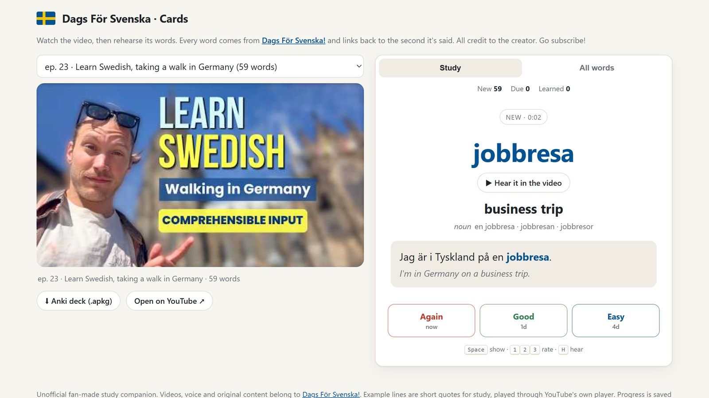
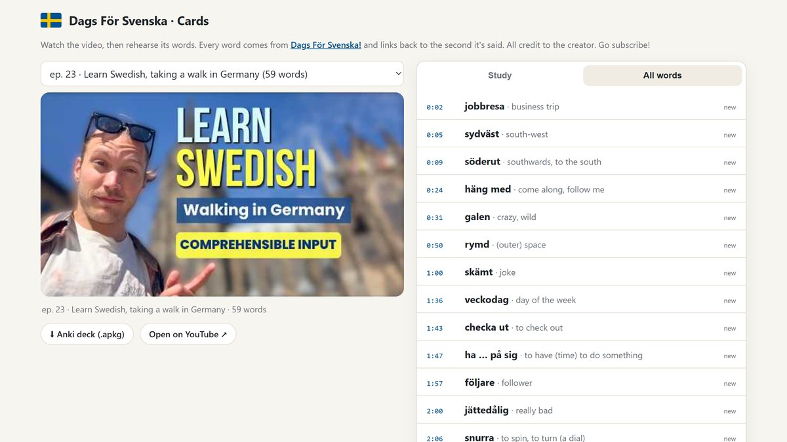
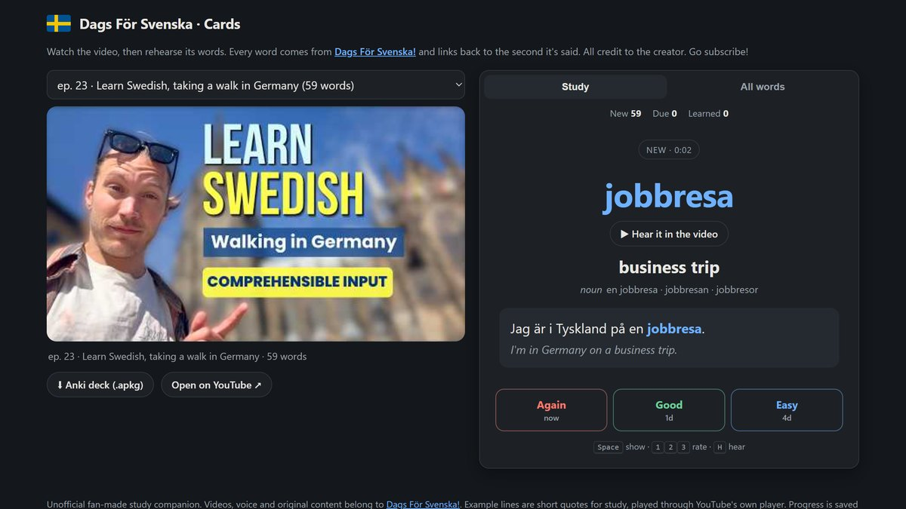
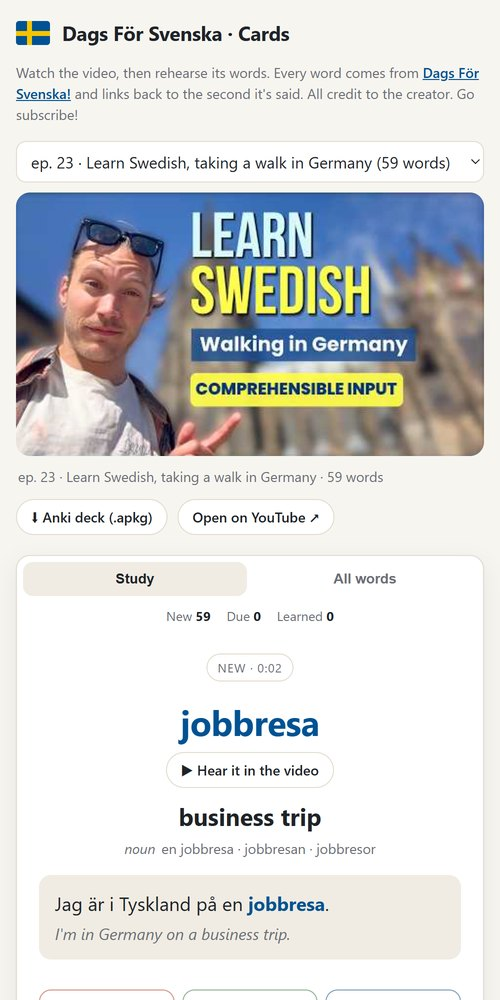
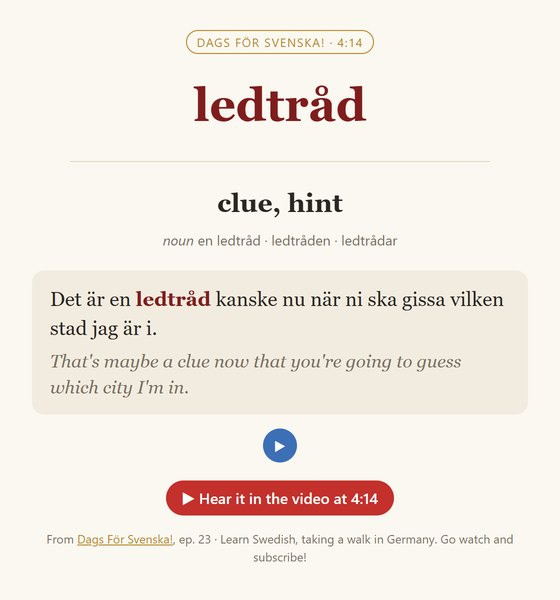

# Dags För Svenska · Cards

**Watch a Swedish video, then rehearse its words.** Flashcards built from the words in
[Dags För Svenska!](https://www.youtube.com/@DagsF%C3%B6rSvenska) videos. Every card links back to the
second the word is said, and one click plays that line in the creator's own voice.

### ▶ [Open the study site](https://rajathpi.github.io/dags-svenska-cards/) · ⬇ [Download the Anki decks](https://github.com/rajathpi/dags-svenska-cards/releases/tag/decks)



> **All credit to [Dags För Svenska!](https://www.youtube.com/@DagsF%C3%B6rSvenska).** This is an unofficial,
> fan-made study companion built out of love for the channel. The videos, voice and original content belong to
> the creator. Go watch and subscribe! The cards quote only the one short line where each word appears.
> The full transcripts are not published here, and the audio plays through YouTube's own player.

## How it works

1. **Watch the video** right on the page.
2. **Study the cards.** You see a Swedish word. Try to remember it, then *Show answer* to get the meaning,
   the grammar forms and the line from the video it came from.
3. **Hear it for real.** *▶ Hear it in the video* jumps the player to that exact moment, plays just
   that sentence, and stops.
4. **Rate yourself** *Again / Good / Easy*. Cards you know come back less often, and the hard ones come back
   sooner (spaced repetition, like Anki). Progress is saved in your browser, no account needed.

| Every word, with the second it's said. Click one to hear it | Dark mode |
|---|---|
|  |  |

| On your phone | In Anki |
|---|---|
|  |  |

**Prefer Anki?** Every video also has an `.apkg` deck with the same cards: Swedish and English audio, the
grammar forms, and a *Hear it in the video* button that opens YouTube at the right second. Import it with
*File → Import*.

## What's inside each card

- the word in its **base form** (*gick → gå*) with grammar forms (*en ledtråd · ledtråden · ledtrådar*)
- a **hand-checked translation**, not machine output
- **the line from the video** where it's said, with an English translation
- a short **tip** where it helps (*utfart* vs *utgång*, how *kiosktätaste* is built, …)
- the **timestamp**, so you can always go back and hear it

## Videos so far

| Episode | Words |
|---|---|
| [ep. 23 · Learn Swedish, taking a walk in Germany](https://www.youtube.com/watch?v=r4eMbzM9QkA) | 59 |

More are on the way.

## Add a video (maintainers)
```
py -3.12 -m yt_dlp --skip-download --write-auto-subs --sub-langs sv-orig --sub-format json3 -o "transcripts/%(id)s" <url>
py -3.12 extract.py <id>          # captions -> timestamped sentences (local only, gitignored)
# write decks/<id>.json: word, pos, forms, english, t, end, sentence (<b>word</b>), sentence_en, note
py -3.12 make_index.py            # refresh the video picker
py -3.11 build_deck.py <id>       # -> build/<id>/dags-for-svenska-<id>.apkg, then attach it to the "decks" release
py -3.12 make_shots.py            # refresh the README screenshots (needs the site on localhost:8053)
```
Auto-caption mistakes get fixed by hand (e.g. "Ren" → Rhen).
